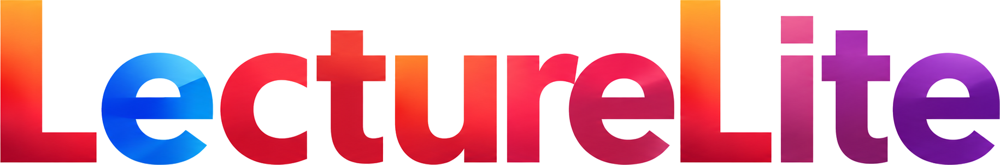

<div align="center">



**文件 + 音频 + 操作时间轴 —— 不用录屏的轻量讲解工具**

把文档、你的声音、讲解时的每一次滚动 / 选词 / 点击，打包成一个可以播放、收藏、分享的 `lecture.zip`

`Python 标准库即可运行` · `HTTPS` · `账号体系` · `个人课程库`

</div>

---

把 `.md` / `.pdf` / `.html` 文档、讲解音频，以及讲解过程中的操作时间轴打包成一个 `lecture.zip`；
打开分享链接即可自动播放还原，无需安装任何软件。支持账号注册登录、个人课程库、收藏、
按 UID 授权分享与可撤销的分享链接。


## ✨ 功能一览

### 录制与生成

- 🎙 **录制**：加载 `.md` / `.pdf` / `.html`（或含图片的文件夹），配合麦克风录制讲解；自动记录
  页面滚动、文字选中、鼠标点击与多文件切换；可关闭「录制声音」，只录操作不申请麦克风
- ✨ **AI 讲解稿**：LLM 逐句生成带锚点的讲稿，问题 / 步骤 / 方法逐个讲全；自动规划每句的视觉操作
  （高亮 / 下划线 / 删除线 / 批注）、标记重难点（🔥）、插入思考停顿（⏸）与章节过渡句；右侧面板可编辑
- 🎧 **一键生成**：「录制演讲」调用 edge-tts 逐句合成（音色 / 语速可选），无需实时录音即可得到
  带语音与完整时间轴的讲解包；在线合成失败自动回退浏览器语音录制
- 🖥 **HTML 演示**：`.html` 直接导入、原样展示、录制翻页与滚动；运行在隔离沙箱，不能读取登录信息或访问网络

### 播放与导航

- ▶️ **播放还原**：按音频时间轴自动滚动页面、还原光标（随机弧线"慢—快—慢"轨迹）与点击涟漪、
  多文件自动切换；拖动进度、0.75×–2× 变速、空格暂停
- 💬 **字幕**：AI 讲解包逐句字幕，可调透明度与字号，设置本地记忆
- ✍️ **标注**：选中文字浮现工具栏——高亮、下划线、删除线、批注（波浪线 + 气泡）、问号与贴纸；
  <kbd>Ctrl</kbd>+<kbd>Z</kbd> 撤回；播放视图标注层只读
- 🧭 **导航**：左侧目录按标题树形折叠、滚动跟随高亮；目录与顶部工具栏均可一键收起

### 账号与课程库

- 👤 **账号体系**：UID + 密码注册 / 登录（PBKDF2 加盐哈希），全站 HTTPS（自动生成自签名证书），
  登录 / 注册接口限速
- 🏠 **个人主页**：我的录制、收藏的课程、分享给我的、回收站四个栏目，支持搜索与排序
- ⭐ **收藏**：播放页一键收藏；同一课程对每个用户独立收藏，互不影响
- ⏱ **续播**：按用户记录播放进度，主页显示"上次看到"，打开自动定位继续播放
- 🔗 **两种分享**：
  - **按 UID 授权**：输入对方 UID，课程出现在对方的「分享给我的」
  - **unlisted 链接**：凭链接即可观看（无需登录），令牌只显示一次、服务端仅存哈希，可随时吊销 / 设有效期
- ♻️ **回收站**：删除进回收站，30 天内可恢复，到期自动清空（含文件与全部授权）

## 🚀 快速开始

```bash
python serve.py            # 启动服务（默认 HTTPS + 自签名证书，仅本机可访问）
python serve.py --lan      # 局域网模式：绑定 0.0.0.0，局域网内可用
python serve.py --http     # 调试用：关闭 HTTPS
```

服务本身仅依赖 Python 标准库；以下按需安装（不装则对应功能不可用，录制 / 播放不受影响）：

```bash
pip install openai         # AI 讲解稿生成（OpenAI 兼容接口）
pip install edge-tts       # 「录制演讲」在线语音合成
```

AI 模型服务用环境变量覆盖默认值（见 `llm/script_generator.py`）：

```bash
set LLM_BASE_URL=http://your-host/v1     # Windows；Linux/macOS 用 export
set LLM_API_KEY=...
set LLM_MODEL=...
```

> 首次用 HTTPS 访问时浏览器会提示证书不受信任（自签名），点「继续访问」即可。

## 📖 使用流程

1. **注册 / 登录**：打开页面，用 UID + 密码注册（即注册即登录）
2. **录制**：主页点「新建讲解」→ 添加文档 → 开始录制 → 边讲边滚动、选词、点击 → 停止
3. **或一键生成**：「自动生成文稿」→ 检查 / 编辑讲稿 → 「录制演讲」直接合成
4. **预览**：播放检查声音、页面位置、标注与图片
5. **保存**：「下载讲解包」备份到本地；「保存到主页」上传到自己的课程库
6. **分享**：主页「分享与管理」按 UID 授权或生成链接；收藏方便下次打开

收藏里内置了四门示例课程（不可删除）：**教你使用 LectureLite**（9 章图文 + 语音，完整使用指南）、
Python 入门、梯度下降入门、条件概率与贝叶斯——都是用 LectureLite 自己录制的。

## 📦 产物结构

```
xxx.lecture.zip
├── 源文件（md / pdf / html / images/ … 按相对路径打包，保留子目录结构）
├── audio.webm / audio.mp3    # 浏览器录制为 webm，edge-tts 合成为 mp3
└── lecture.json              # 时间轴：states + cursor + clicks + fileSwitches
                              #           + annotations + annotationPopups + script
```

`script` 是讲稿时间轴，每句一条：

```json
{ "text": "…", "anchor": "文档原文锚点", "t": 12500, "d": 3200,
  "op":  { "kind": "highlight", "target": "…" },   // 该句触发的视觉操作（可选）
  "pause": 1500,    // 句尾思考停顿（毫秒，可选）
  "key": true }     // 重难点句（可选）
```

`anchor` 是文档中逐字出现的原文片段，播放端靠它在页面里定位该句——用于自动滚动、
光标落点与标注创建，因此讲解包与源文档天然对齐。

## 🔒 安全边界

- 全站 HTTPS（首次启动自动生成自签名证书到 `cert/`）；`--http` 可显式关闭
- 账号密码仅存 PBKDF2-SHA256 加盐哈希（20 万次迭代）；会话为随机高熵 HttpOnly Cookie；
  登录 / 注册每 IP+UID 5 分钟限 10 次
- 所有权与可见性集中在服务端统一校验：录制文件不再静态暴露，只能经权限校验的接口下载；
  已删除内容对任何调用者一律不存在（tombstone）
- 分享令牌服务端只存 SHA-256 哈希，原始令牌仅创建时返回一次；吊销 / 过期 / 删除立即失效
- 上传限制 100MB 且流式落盘；JSON 请求体 5MB 上限；TTS 句子数量 / 长度 / 倍速受限；重操作并发上限 3
- 页面启用 CSP；Markdown 渲染关闭原始 HTML，标注文本一律走 DOM API
- 数据文件（`data/store.json`）与运行时上传（`shared/`）均不入库，仅保存在本机

## 🧰 项目结构

```
MDLecture/
├── lecture-lite.html        # 单页前端（录制 + 播放 + AI 讲稿 + 字幕 + 标注）
├── home.html                # 个人课程库（我的录制 / 收藏 / 分享 / 回收站）
├── serve.py                 # HTTPS 服务 + 账号体系 + 录制归属 / 分享 / 收藏 / 进度 API
├── tools/                   # 标注工具、选区工具栏
│   ├── make_demo_courses.py #   示例课程生成器（edge-tts + 时间轴）
│   ├── make_guide_course.py #   内置使用指南课程生成器
│   └── test_guide.py        #   回归测试（另有 test-html-timeline.cjs）
├── llm/                     # LLM 讲解稿生成 + edge-tts 语音合成
├── docs/                    # logo、截图、使用指南图文讲义
├── demo/                    # 内置示例课程包（启动时自动播种，不可删除）
├── data/                    # 账号 / 录制关系 / 收藏 / 进度（运行时生成，不入库）
└── shared/                  # 运行时上传的录制文件（不入库）
```

## ✅ 环境要求

- Python 3.10+（HTTPS 证书生成需 `pip install cryptography`）
- 建议使用 Chrome（依赖 MediaRecorder / webkitdirectory）
- 页面需联网加载渲染库（markdown-it / pdf.js / jszip，走 CDN）
- AI 文稿生成需 `openai` 包且模型服务可达；edge-tts 在线合成需能访问微软 TTS 服务
