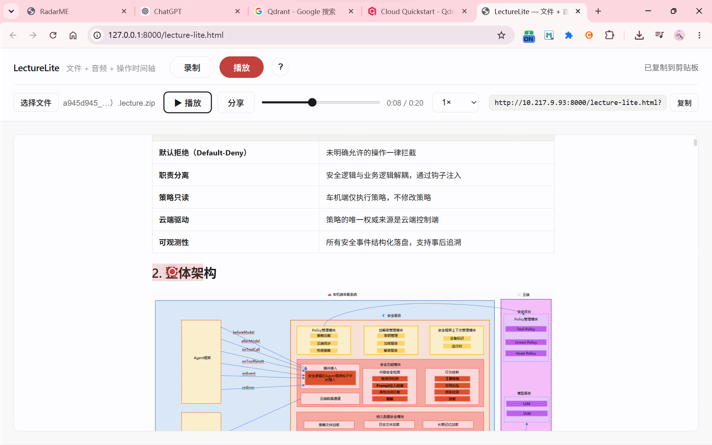

# LectureLite

**文件 + 音频 + 操作时间轴** —— 不用录屏的轻量讲解工具。

把 `.md` / `.pdf` 文档、你的讲解音频，以及讲解过程中的操作（滚动、选词、点击）
打包成一个 `lecture.zip`；同事打开分享链接即可自动播放还原，无需安装任何软件。

## 效果预览



## 功能

- 🎙 **录制**：加载 `.md` / `.pdf`（或选择含 `images/` 的 md 项目文件夹），配合麦克风录制讲解；
  自动记录页面滚动位置、文字选中、鼠标点击；支持**多文件工作区**——像浏览器 tab 一样切换/追加文件，停止后导出 `lecture.zip`
- ✍️ **标注**：鼠标选中文字后自动出现浮动工具栏，也可右击呼出；主栏提供高亮、下划线、删除线和批注，问号与透明线性贴纸收纳在“更多”中。批注以波浪线标记，悬停或点击后显示内容
- ▶️ **播放**：加载 zip 后按音频时间轴自动滚动页面、还原光标与点击效果；录制中的多文件切换也会自动还原。支持拖动进度、0.75×–2× 变速，空格暂停/继续
- 🔗 **分享**：配合 `serve.py` 把 zip 上传到局域网服务，一键生成播放链接发给同事


## 快速开始

依赖仅 Python 标准库：

```bash
python serve.py
```

启动后自动打开浏览器，控制台会打印本机与局域网访问地址。

## 使用说明

1. **录制**：切到「录制」→ 选择文件 / 文件夹 → 开始录制（允许麦克风）→ 边讲边滚动、选词、点击；可点工作区 `+` 添加更多文件并切换 → 停止后导出或分享
2. **标注**：拖选一段文字 → 在浮动提示中选择标注工具；点击任意已标注内容可删除该标注，按 <kbd>Ctrl</kbd>+<kbd>Z</kbd> 可撤回最近一次新增或删除。批注内容通过波浪线悬停查看，其显隐过程也会进入录制时间轴
3. **播放**：切到「播放」→ 选择 `lecture.zip` → 播放
4. **分享**：点「分享」生成局域网链接，同事打开即自动加载并播放

页面也暴露了统一调用入口 `window.lectureLiteAnnotations.add(annotation)`，后续 AI 讲解可传入 `type`、`fi`、`offsets`（Markdown）或 `coords`（PDF）来创建同样的时间轴标注。

## 产物结构

```
xxx.lecture.zip
├── 源文件（md / pdf / images/ … 多个文件）
├── audio.webm
└── lecture.json    # 时间轴：states + cursor + clicks + fileSwitches + annotations + annotationPopups
```

## 环境要求

- 建议使用 Chrome（依赖 MediaRecorder / webkitdirectory）
- 页面需联网加载渲染库（markdown-it / pdf.js / jszip，走 CDN）

## 项目结构

```
MDLecture/
├── lecture-lite.html    # 单页前端（录制 + 播放）
├── tools/               # 选区工具栏与六种独立标注工具
├── serve.py             # 局域网 HTTP 服务 + /share 分享接口
├── docs/screenshot.png  # 界面截图
└── shared/              # 运行时上传的分享文件（不入库）
```
