# 教你使用 LectureLite

把文档、声音和讲解动作放进一个可以分享的课程。本指南按「准备 → 讲解 → 检查 → 保存 → 学习」带你完成第一次使用。截图来自本地隔离测试账号，不包含真实用户数据。

## 01 · 认识主页

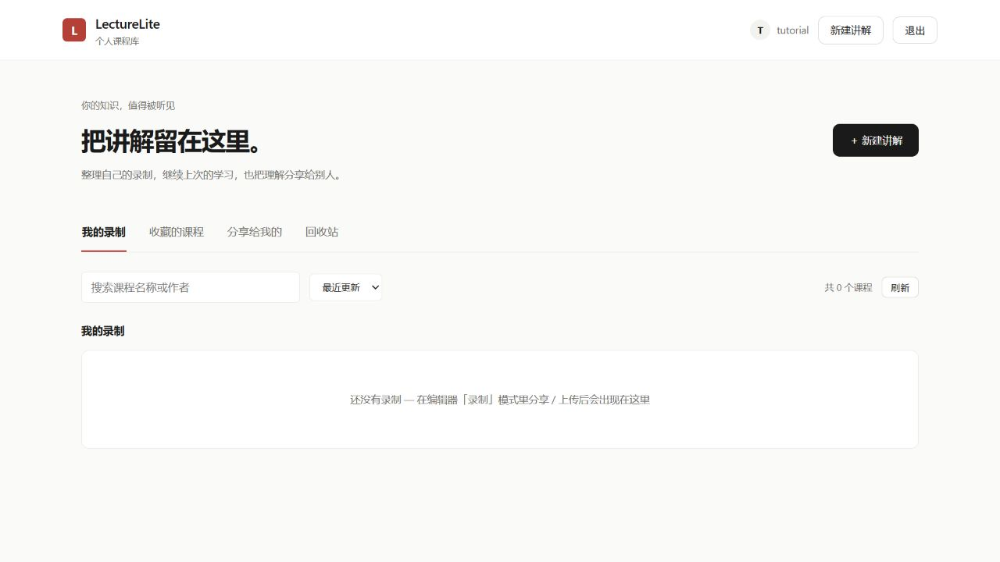

主页是课程库，不是编辑器。「我的录制」放自己保存的课程；「收藏的课程」集中常看的内容与这份入门指南；「分享给我的」放别人通过你的 UID 授权的内容；「回收站」用于恢复误删课程。四个栏目分开显示，搜索和排序只作用于当前栏目。进入课程时，有进度的课程可以继续上次的位置。

点击右上角或页面中的「新建讲解」进入编辑器。登录账号后，保存的课程归属于该账号；不要把自己的密码当作分享凭据。给别人授权时填写对方的 UID，而不是密码。

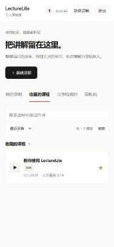

## 02 · 添加第一份文档

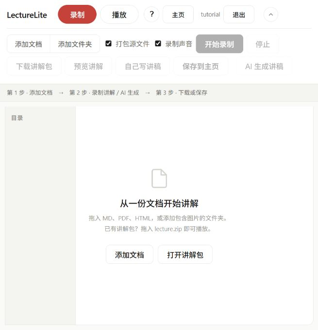

点击「添加文档」选择 Markdown、PDF 或 HTML，也可以直接拖入页面。Markdown 引用了本地图片时，使用「添加文件夹」，把文档和图片一起加入并保留相对路径。多个文档显示在顶部标签中，点击标签切换讲解对象。左侧目录用于定位 Markdown 的章节。

「打包源文件」建议保持勾选：这样下载或保存的 lecture.zip 包含源文档，听众不必再找原文件。取消勾选只适用于你能另外提供完全相同源文件的场景。不要把含有账号、密钥或隐私内容的文档打包给别人。

## 03 · 亲自录制：声音与动作一起留下

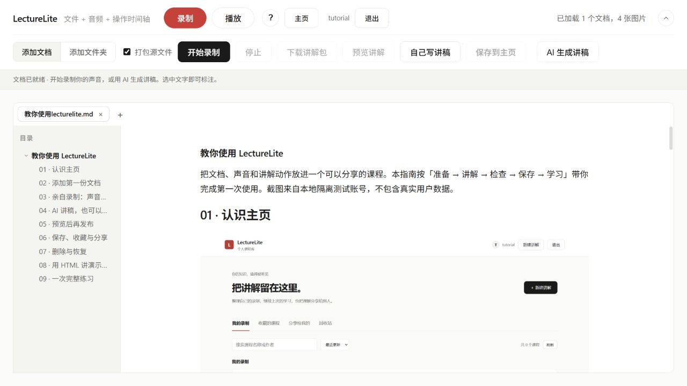

准备好麦克风后点击「开始录制」，按浏览器提示允许麦克风。HTTPS 或 localhost 环境下才能正常使用媒体权限。说话时滚动文档、移动光标、切换文件；这些动作和声音会写入同一时间轴。选中 Markdown 正文可以使用高亮、下划线、删除线、批注等标注工具。先说明观点，再标注重点，效果通常比整页涂色更清楚。

只想演示操作、不方便说话时，取消工具栏中的「录制声音」，即可不使用麦克风录制翻页与滚动。

完成后点击「停止」，等待音频整理结束。录制期间不要关闭标签页、替换文档或切换模式。页面会提示未保存内容，但浏览器异常关闭不等于自动备份；重要内容请及时保存。

## 04 · AI 讲稿，也可以自己写

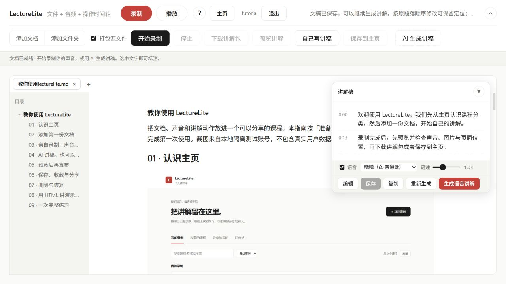

选择「AI 生成讲稿」可根据当前文档生成逐句讲稿，需要服务端模型配置可用。生成后先读一遍：核对事实、术语和发音，删掉不必要的铺垫，再点击「编辑」调整。「自己写讲稿」不依赖模型，每个段落一行，写好后点击「保存」。原顺序修改可保留已有的文档定位；增删段落后要预览确认对应位置。

勾选「语音」，选择声音与语速，再点击「生成语音讲解」合成课程。在线合成依赖网络。取消「语音」可生成只有字幕和操作时间轴的讲解包，适合无声演示或先检查内容。HTML 的自动翻页依赖讲稿定位到幻灯片文字；自己写稿时优先使用幻灯片中的标题或原句作为定位线索，复杂流程建议亲自录制。

## 05 · 预览后再发布

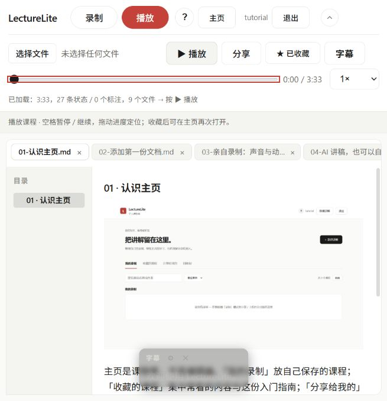

完成录制或生成后，点击「预览讲解」。播放器中点击播放/暂停，拖动进度条检查前后段落，用速度选择器调整播放速度。空格可以暂停或继续；输入文字时应先把焦点留在输入框，避免误触快捷键。字幕可以开关，方便静音阅读和核对讲稿。

重点检查三件事：声音听得清吗？正在讲的内容与页面位置一致吗？图片和标注完整吗？下载的讲解包也应重新打开检查一次，尤其是首次使用 HTML 或本地图片时。没有语音的课程会显示「无音频」，这是时间轴模式而不是播放故障。

## 06 · 保存、收藏与分享

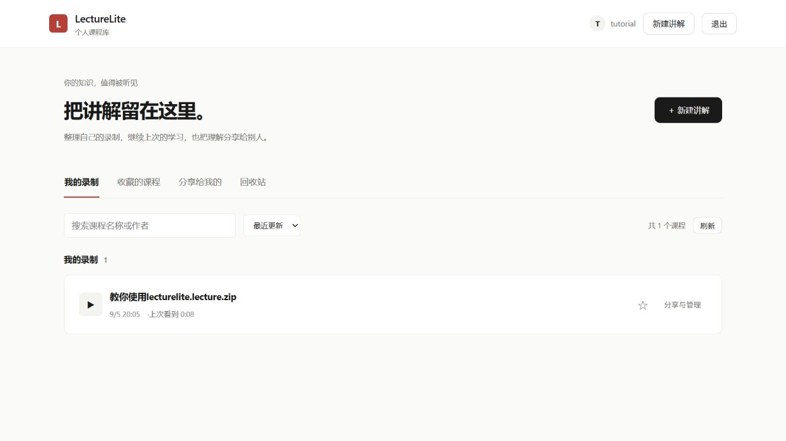

「下载讲解包」把 lecture.zip 保存到你的电脑，适合备份与离线分发；「保存到主页」上传到自己的账号，之后可从「我的录制」进入。两者不是同一回事：下载不等于上传，上传也不自动对所有人公开。完成后可以回主页收藏自己的课程。

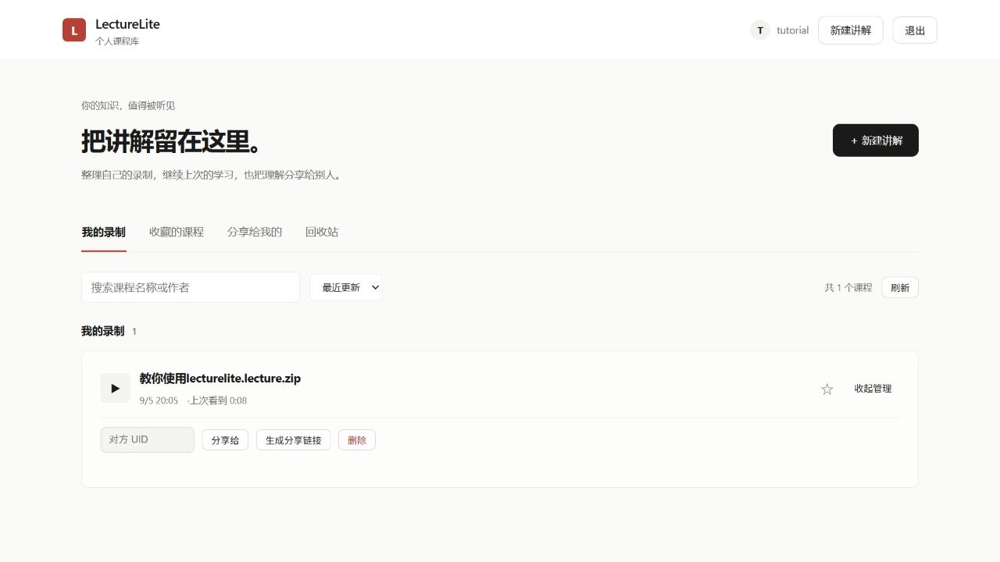

打开课程的「分享与管理」，输入对方 UID 授权，或者生成带有效期的分享链接。链接拿到者在有效期内可以访问，不要公开发布敏感课程链接。复制成功提示出现后再发送；可撤销链接以停止后续访问。取消收藏只从收藏列表移除，不删除原课程。

## 07 · 删除与恢复

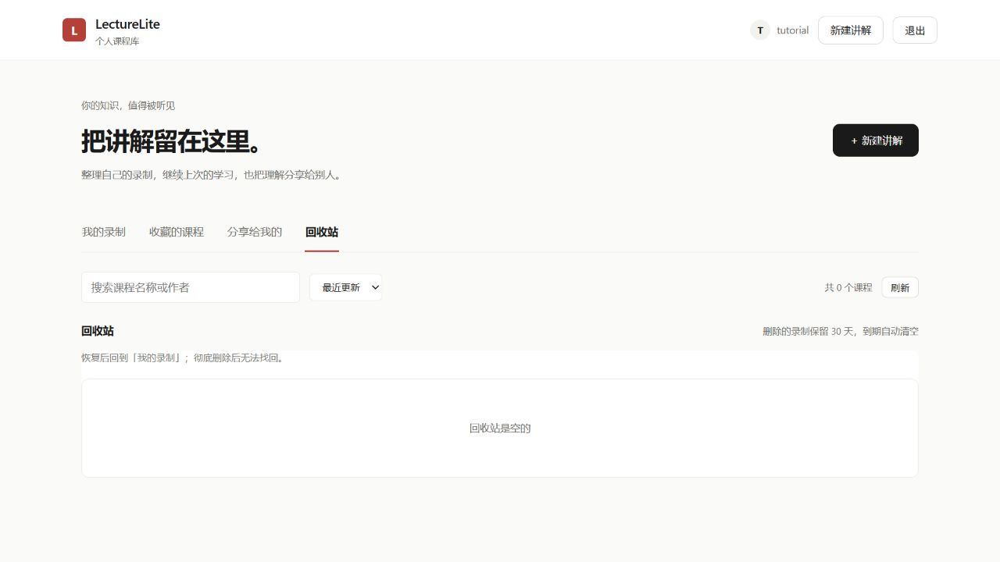

不再需要的自建课程可以移入回收站，误删时从回收站恢复。永久删除不可撤销；过期回收站内容也会按服务端保留策略清理，所以课程库不能代替独立备份。删除和授权管理只针对自己拥有的课程。内置指南是示例内容，更新指南不会清空你的真实课程和个人收藏。

## 08 · 用 HTML 讲演示文稿

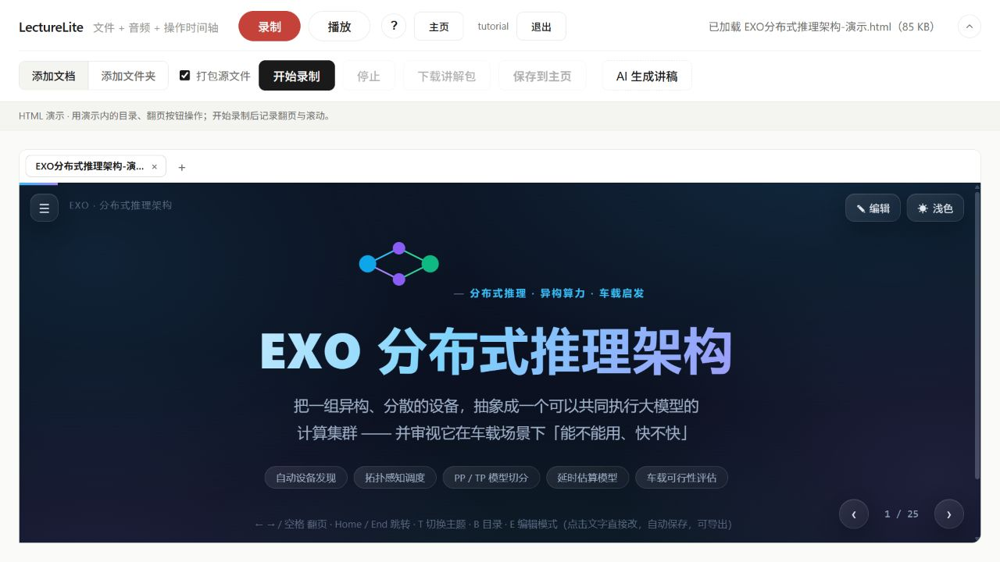

直接选择 .html 或 .htm 文件即可。示例 EXO 演示保留了原来的主题、目录和翻页按钮，不会被转换成 Markdown。开始录制后，在演示内部翻页、展开目录、滚动页面；停止后预览，检查播放进度跳转时页码是否正确。

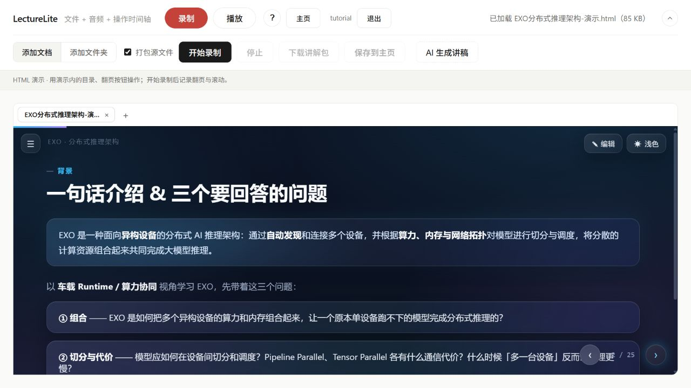

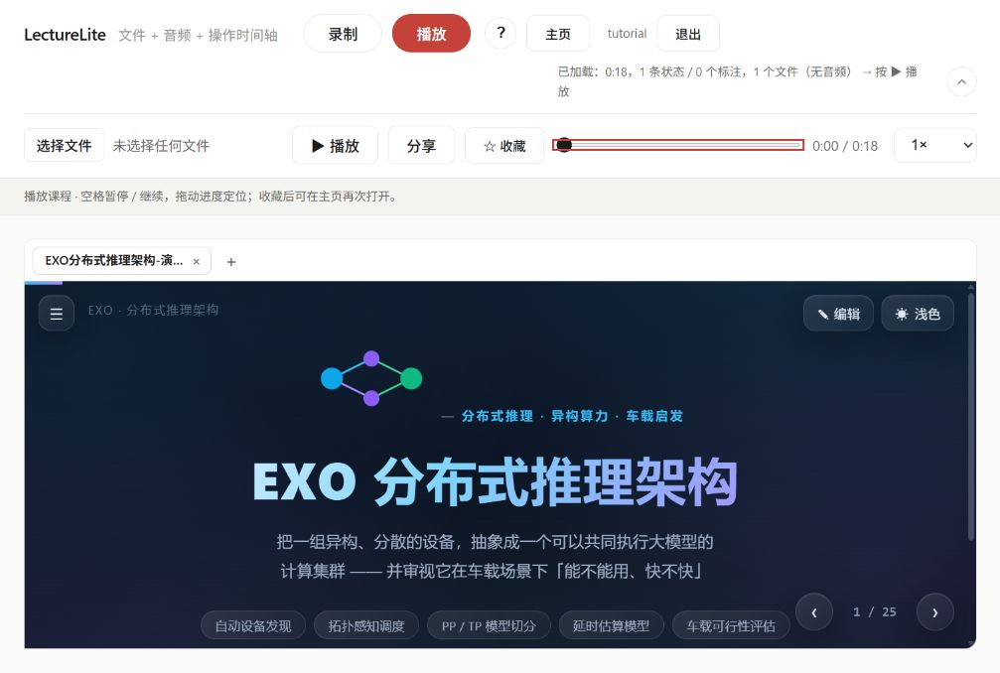

优先使用自包含 HTML：CSS、脚本内联，图片使用内嵌数据或随文档一起导入。为保护账号，HTML 在隔离沙箱运行，不能读取 LectureLite 的登录信息，也不能请求网络或打开任意外部页面。依赖 CDN、登录接口、浏览器持久存储的网页不是当前支持目标。若 HTML 自带编辑功能，请先在原文件中编辑、导出，再导入 LectureLite；演示中临时修改文本不保证写回源文件。

当前记录的是 DOM 可见状态、翻页和滚动，不是屏幕视频：Canvas/WebGL 动画、嵌入视频、任意动态新增节点不保证可重放。EXO 这类固定幻灯片适合使用；陌生模板请先录十秒并拖动进度检查。AI 自动翻页目前面向使用 .slide 幻灯片结构的演示，普通 HTML 可以手动讲解与录制滚动。

## 09 · 一次完整练习

1. 添加一个带标题和图片的 Markdown 文件夹。
2. 写三段讲稿，保存后先生成无语音版本，预览页面位置。
3. 准备好声音后生成语音，或亲自录制一分钟并做一个标注。
4. 下载讲解包，再保存到主页；给课程加收藏。
5. 生成分享链接，在其他账号中验证访问。测试完撤销链接。
6. 导入自己的 HTML，录制两次翻页，预览并拖回开头检查。

遇到问题先看顶部状态提示。导入失败检查后缀、包结构和图片路径；语音失败检查模型/语音服务、网络与权限；分享失败先确认服务在运行、账号已登录。保留原始文档和下载的讲解包，能让迁移与恢复更安心。
